<h1 align="center">💙 Caring</h1>

<h3 align="center">
보호자와 어르신을 위한 맞춤형 요양기관<br/>
탐색 · 추천 · 상담 · 예약 통합 플랫폼
</h3>

<p align="center">
  <b>세종대학교 컴퓨터공학과 Capstone Design · 4인 팀 프로젝트</b>
</p>

<p align="center">
  
  
  
  
  
  
</p>

<br/>

<p align="center">
  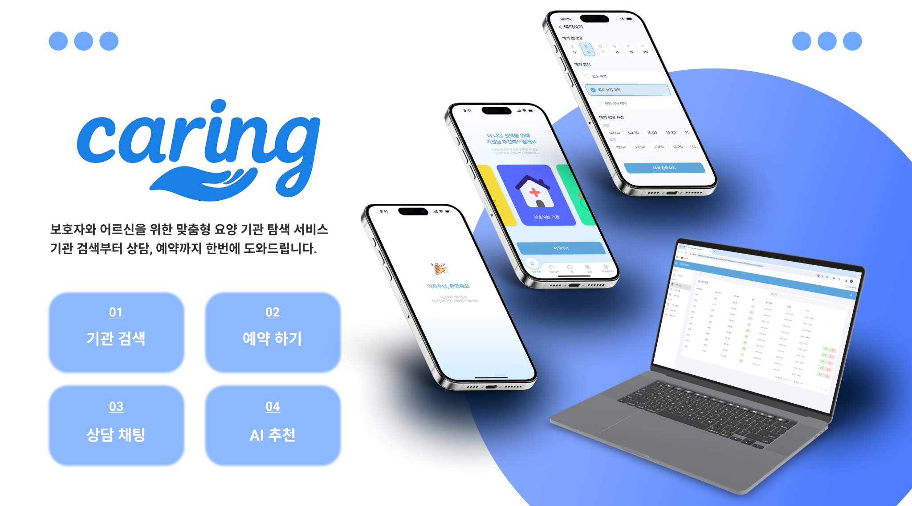
</p>

<br/>

## 📌 Project Highlights

| **프로젝트 수상 2회** | **프로그램 저작물 2건** | **SW자산뱅크 등재** | **4인 팀 · 팀장** |
|:---:|:---:|:---:|:---:|
| 학술제 2등 · 인기상(4등) | 서비스 · AI 기능 | `ASSET_0015923` | Backend · PO/PM |

> ### 💡 “요구사항은 상태·권한·인터페이스·완료 기준으로 구체화되어야 한다고 생각했습니다.”
>
> 실제 요양기관을 방문해 업무 절차와 불편을 확인하고,  
> 이를 **예약 상태·역할별 권한·검색 조건·데이터 구조·검증 기준**으로 구체화했습니다.

### 👩‍💻 프로젝트 한눈에 보기

| 항목 | 내용 |
|---|---|
| **프로젝트** | Caring · 생활복지형 어르신 맞춤 케어 플랫폼 |
| **개발 기간** | 2025.09 ~ 2025.12 |
| **팀** | 4인 |
| **역할** | Team Lead · Backend · PO/PM |
| **핵심 경험** | 현장 요구분석 · 상태/권한 모델링 · 데이터 정합성 · 실제 DB 검증 |
| **Organization** | [Caring-Team](https://github.com/Caring-Team) |
| **Backend** | [caring-backend](https://github.com/Caring-Team/caring-backend) |
| **Frontend** | [caring-front](https://github.com/Caring-Team/caring-front) |
| **AI** | [caring-ai](https://github.com/Caring-Team/caring-ai) |

> ℹ️ 이 저장소는 채용 포트폴리오용 개인 Showcase입니다.  
> 프로젝트 전체 기술과 개인 역할을 구분하여 작성했습니다.

---

## 📜 목차

1. [프로젝트 소개](#1-프로젝트-소개-)
2. [서비스 시연](#2-서비스-시연-)
3. [현장에서 요구사항을 찾다](#3-현장에서-요구사항을-찾다-)
4. [담당 역할 및 협업](#4-담당-역할-및-협업-)
5. [시스템 아키텍처](#5-시스템-아키텍처-)
6. [핵심 설계](#6-핵심-설계-)
7. [트러블 슈팅](#7-트러블-슈팅-)
8. [AI 추천 시스템](#8-ai-추천-시스템-)
9. [테스트와 검증](#9-테스트와-검증-)
10. [기술 구성 및 협업 방식](#10-기술-구성-및-협업-방식-)
11. [성과](#11-성과-)
12. [What I Learned](#12-what-i-learned-)

---

## 1. 프로젝트 소개 🌿

### 요양기관을 찾는 과정의 불편을 하나의 서비스 흐름으로 연결하다

요양기관을 선택하려면 보호자가 기관별 정보를 직접 찾아 비교하고,
상담 가능 여부와 비용을 확인한 뒤 다시 일정을 조율해야 했습니다.

기관 역시 상담·예약·리뷰·홍보 업무를 여러 경로에서 관리하고 있어
사용자와 기관 모두에게 반복적인 확인 작업이 발생했습니다.

**Caring은 기관 탐색부터 이용 후 리뷰까지 하나의 서비스 흐름으로 연결했습니다.**

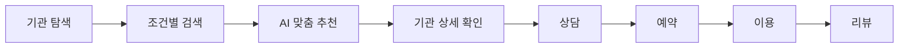

### 핵심 사용자

| 사용자 | 주요 기능 |
|---|---|
| **보호자 / 일반 사용자** | 기관 검색 · AI 추천 · 상담 · 예약 · 리뷰 |
| **기관 관리자 / 직원** | 기관 정보 · 예약 · 직원 · 리뷰 · 홍보 관리 |
| **플랫폼 관리자** | 사용자 · 기관 · 신고 리뷰 · 서비스 운영 관리 |

---

## 2. 서비스 시연 🎬

### 🔎 기관 검색 · 조건 필터

기관명뿐 아니라 기관 유형, 전문 분야, 위치, 거리, 가격 등
여러 조건을 조합해 상황에 맞는 기관을 탐색할 수 있습니다.

<p align="center">
  
</p>

- 기관명 및 기관 유형 검색
- 전문 분야·서비스 조건 설정
- 지역 및 현재 위치 기준 거리 검색
- 가격 범위 설정
- 입소 가능 여부 확인

<br/>

### 💬 상담 · 예약

기관 정보를 확인한 뒤 앱 안에서 상담을 진행하고,
가능한 날짜와 시간대를 확인해 예약까지 이어갈 수 있습니다.

<p align="center">
  
</p>

- 기관 담당자와 상담 채팅
- 상담·방문 예약 방식 선택
- 예약 가능한 날짜 및 시간 확인
- 예약 진행 상태 확인

> 상담 채팅의 최종 구현은 **Long Polling** 방식입니다.

<br/>

### 🤖 리뷰 · AI 맞춤 기관 추천

사용자의 선호와 어르신의 상태를 바탕으로
추천 기관과 추천 사유, 핵심 키워드를 제공합니다.

<p align="center">
  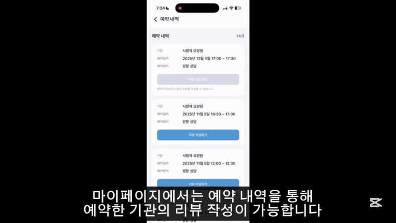
</p>

- 사용자·어르신 특성 기반 기관 추천
- 추천 기관 Top-5 제공
- 추천 사유와 핵심 키워드 제공
- 기관 리뷰와 대표 태그 확인

<br/>

### 📅 기관 관리자 예약 · 상품 관리

기관 관리자는 웹에서 예약 요청을 확인하고
요일·시간대별 예약 상품과 운영 가능 시간을 관리합니다.

<p align="center">
  
</p>

- 예약 요청 및 상태 조회
- 예약 확정·완료·취소 등 상태 관리
- 요일·시간대별 예약 상품 등록
- 사용자 노출 여부 설정

<br/>

### 🏢 기관 운영 관리

기관 정보뿐 아니라 직원, 설명 태그, 홍보 서비스 등을
관리자 웹에서 함께 관리합니다.

<p align="center">
  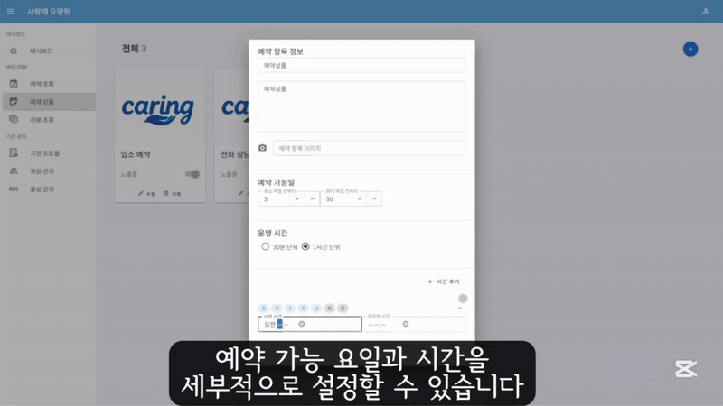
</p>

- 기관 직원 및 권한 관리
- 기관 설명 태그 관리
- 홍보 서비스 신청·조회
- 예약·리뷰 현황 확인

---

## 3. 현장에서 요구사항을 찾다 🏥

### 실제 요양기관의 업무 흐름부터 확인했습니다

서비스 기능을 정하기 전에
실제 요양기관을 방문해 기관 관리자와 인터뷰를 진행했습니다.

<p align="center">
  
</p>

<p align="center">
  <sub>실제 요양기관을 방문해 기관 관리자와 업무 절차와 현장의 불편을 확인했습니다.</sub>
</p>

현장에서 **상담 접수, 입소 가능 여부 확인, 보호자 응대,
예약 관리, 리뷰 관리**가 어떤 방식으로 이루어지는지 들었습니다.

또한 어르신과 보호자의 정보를 다루는 서비스인 만큼
사용자 역할과 데이터 접근 범위를 어떻게 구분할지도 함께 검토했습니다.

### 인터뷰에서 확인한 문제를 시스템 규칙으로 바꿨습니다

| 현장에서 확인한 내용 | 서비스에 반영한 기준 |
|---|---|
| 보호자가 기관마다 다른 정보를 직접 비교해야 함 | 기관 유형 · 전문 분야 · 위치 · 거리 · 가격 등을 공통 검색 조건으로 구성 |
| 예약 접수 이후 진행 상태를 기관에서 관리해야 함 | `PENDING · CONFIRMED · COMPLETED · CANCELED` 상태와 전이 조건 정의 |
| 기관 관리자와 직원의 담당 업무가 다름 | OWNER / STAFF 역할별 접근 범위 분리 |
| 가입이 완료되지 않은 사용자의 접근을 제한해야 함 | 임시 가입 상태를 별도 Role로 관리 |
| 기관의 프로그램과 특성을 알릴 수단이 필요함 | 기관 설명 태그와 홍보 관리 기능 구성 |
| 기관 정보 변경이 추천 결과에도 반영되어야 함 | 기관 CRUD와 AI 임베딩 상태 연동 |

> 요구사항을 기능 이름으로 정리하는 데 그치지 않고  
> **누가 어떤 상태에서 무엇을 할 수 있는지**까지 SW 규칙으로 구체화했습니다.

---

## 4. 담당 역할 및 협업 👩‍💻

### Team Lead · Backend · PO/PM

4인 팀에서 팀장으로 참여해
현장에서 확인한 요구사항과 서비스 흐름을 정리하고,
기능·설계 기준과 프로젝트 일정을 조율했습니다.

백엔드 개발에도 참여하며
사용자와 기관의 업무 흐름을 상태·권한·데이터 구조로 구체화했습니다.

### 주요 역할

- 요양기관 방문 및 현장 요구사항 정리
- 사용자·기관 관리자 업무 흐름 구체화
- 기능 우선순위 및 일정 조율
- API·데이터 구조·역할별 기능 기준 정리
- Spring Boot 기반 Backend 개발 참여
- Frontend · Backend · AI 연동 기준 조율
- GitHub Issue / Pull Request 기반 협업
- 프로젝트 발표 및 결과 정리

> 세부 기술 구현은 프로젝트 전체 코드 기준으로 설명하며,  
> 개인 역할과 팀 전체 구현을 구분해 작성했습니다.

---

## 5. 시스템 아키텍처 🏗️

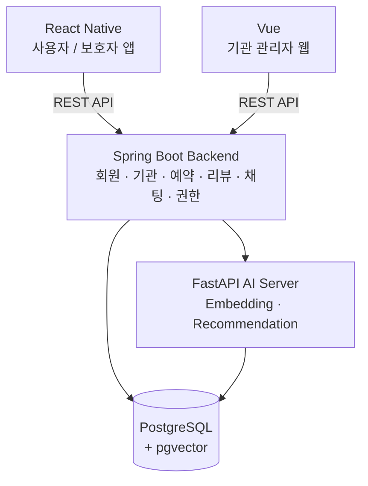

### Repository 구성

| Repository | 역할 |
|---|---|
| [caring-backend](https://github.com/Caring-Team/caring-backend) | 회원·기관·예약·리뷰·채팅·권한 등 서버 로직 |
| [caring-front](https://github.com/Caring-Team/caring-front) | 사용자 모바일 애플리케이션 |
| [caring-ai](https://github.com/Caring-Team/caring-ai) | 기관 임베딩 및 추천 로직 |

---

## 6. 핵심 설계 🧩

### 6-1. 예약 상태와 변경 시각을 하나의 규칙으로 관리

예약은 업무 진행 과정에 따라 상태가 계속 변하는 데이터였습니다.

상태만 변경하고 변경 시각을 빠뜨리거나,
허용되지 않은 상태 전이가 발생하지 않도록
상태 변경 규칙을 `Reservation` 내부에서 관리했습니다.

```java
public void updateToConfirmed() {
    validateStatus(ReservationStatus.PENDING);

    this.status = ReservationStatus.CONFIRMED;
    this.confirmedAt = LocalDateTime.now();
}

public void updateToCompleted() {
    validateStatus(ReservationStatus.CONFIRMED);

    this.status = ReservationStatus.COMPLETED;
    this.completedAt = LocalDateTime.now();
}
```

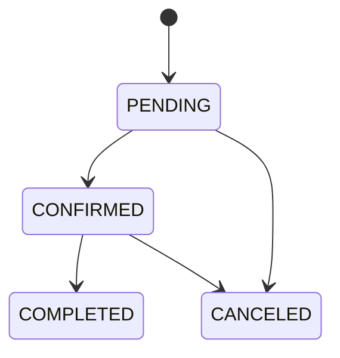

**설계 효과**

- 상태 변경과 변경 시각을 함께 관리
- 허용하지 않는 상태 전이 차단
- 상태 관련 규칙을 한곳에서 관리

> 상태를 하나의 값이 아니라 **다음 동작을 결정하는 업무 규칙**으로 다뤘습니다.

---

### 6-2. 인증 중간 상태까지 Role로 모델링

소셜 연동은 완료했지만
회원가입 정보 입력이 끝나지 않은 사용자가 존재했습니다.

이를 정식 회원과 동일하게 처리하면
가입 완료 전에도 다른 API에 접근할 수 있습니다.

프로젝트에서는 중간 상태도 별도 Role로 표현했습니다.

| 사용자 상태 | 접근 제어 |
|---|---|
| 가입 완료 보호자 | `ROLE_USER` |
| 소셜 연동 완료·가입 미완료 | `ROLE_TEMP_OAUTH` |
| 기관 OWNER | OWNER 권한 |
| 기관 STAFF | STAFF 권한 |
| 기관 가입 미완료 | 임시 기관 Role |

임시 사용자는 회원가입에 필요한 기능만 사용할 수 있도록
Security Layer에서 접근 범위를 제한했습니다.

---

### 6-3. 여러 기관 검색 조건을 독립적으로 관리

기관 검색에는 기관명뿐 아니라
기관 유형·전문 분야·가격·위치·거리 등 여러 조건이 사용됩니다.

QueryDSL 조건식을 분리해
필요한 검색 조건만 조합할 수 있도록 구성했습니다.

```java
.where(
    notDeleted(),
    nameContains(filter.getName()),
    institutionTypeEq(filter.getInstitutionType()),
    priceLoe(filter.getMaxPrice())
)
```

거리 기반 검색에는 PostgreSQL Native Query와
Haversine 계산을 활용했습니다.

<p align="center">
  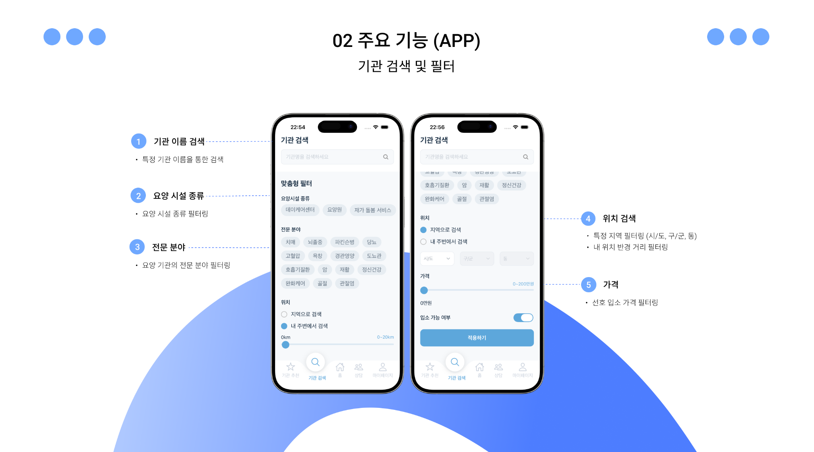
</p>

---

## 7. 트러블 슈팅 🛠️

### ⭐ 01. H2에서 통과해도 실제 PostgreSQL에서는 다를 수 있다

> **테스트 편의보다 실제 실행 환경과의 차이를 줄이는 것을 우선했습니다.**

#### 🔴 Problem

기관 거리 검색에는 Native Haversine Query와
PostgreSQL 환경에 의존하는 동작이 포함되어 있었습니다.

H2에서는 이를 실제 PostgreSQL과 동일하게 검증하기 어려웠습니다.

#### 🔍 Decision

통합 테스트도 실제 PostgreSQL을 사용하고,
외부 서비스만 Mock으로 분리했습니다.

```text
Integration Test

실제 사용
└─ PostgreSQL

Mock
├─ Kakao Geocoding API
└─ S3 등 외부 서비스
```

#### ✅ Result

- PostgreSQL Native Query 실제 동작 검증
- 테스트 DB와 실제 DB 차이에서 발생할 수 있는 오류 감소
- 외부 서비스 상태와 관계없이 반복 가능한 통합 테스트 구성

> **실제 환경에서도 같은 결과가 나오는지를 검증 기준으로 삼았습니다.**

---

### 02. Soft Delete 정책과 JPA Cascade가 충돌한 문제

<details>
<summary><b>상세 내용 펼쳐보기</b></summary>

<br/>

프로젝트는 데이터를 즉시 삭제하지 않고
`deleted = true`로 상태를 변경하는 soft delete 정책을 사용했습니다.

하지만 기관 삭제 과정에서 연관 데이터가
논리 삭제가 아니라 DB에서 실제로 삭제되는 문제가 발생했습니다.

#### Root Cause

```java
cascade = CascadeType.ALL
orphanRemoval = true
```

REMOVE 전파와 `orphanRemoval` 설정이
프로젝트의 soft delete 정책과 충돌하고 있었습니다.

#### Solution

```java
@OneToMany(
    mappedBy = "institution",
    cascade = CascadeType.PERSIST,
    orphanRemoval = false
)
```

- Cascade 범위를 `PERSIST`로 축소
- `orphanRemoval` 비활성화
- 삭제 전 연관관계를 명시적으로 관리

> 코드의 의도뿐 아니라 **DB에 실제 어떤 결과가 남는지** 확인해야 했습니다.

</details>

---

### 03. 실제로 시간이 지나기를 기다리지 않고 날짜 조건 검증하기

<details>
<summary><b>상세 내용 펼쳐보기</b></summary>

<br/>

날짜에 따라 허용 여부가 달라지는 업무 규칙을 검증하기 위해
테스트 데이터의 `created_at`을 PostgreSQL에서 과거 시점으로 변경했습니다.

```java
entityManager.createNativeQuery(
    "UPDATE review " +
    "SET created_at = :pastDate " +
    "WHERE id = :reviewId"
)
.setParameter(
    "pastDate",
    LocalDateTime.now().minusDays(31)
)
.executeUpdate();
```

실제 DB 안에서 과거 상태를 만든 뒤
날짜 기반 규칙을 검증했습니다.

</details>

---

### 04. 상담 채팅의 현재 구현

<details>
<summary><b>상세 내용 펼쳐보기</b></summary>

<br/>

Caring의 상담 채팅 최종 구현은 **Long Polling** 방식입니다.

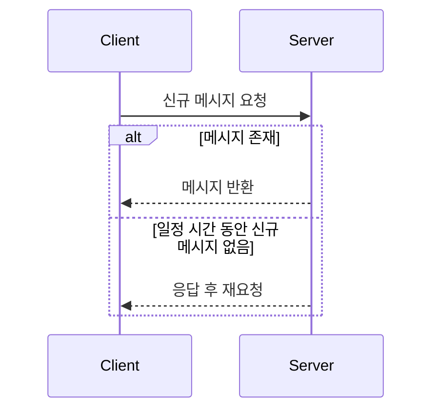

서비스 규모가 커질 경우
WebSocket 또는 SSE 방식으로 전환할 수 있도록
현재 구조의 한계도 함께 분석했습니다.

</details>

---

## 8. AI 추천 시스템 🤖

### 사용자와 기관 정보를 같은 벡터 공간에서 비교

최종 구현에서는 사용자·어르신 정보와 기관 정보를
텍스트로 구조화한 뒤 동일한 임베딩 모델로 벡터화했습니다.

<p align="center">
  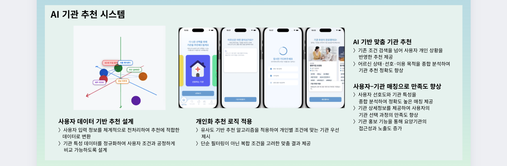
</p>

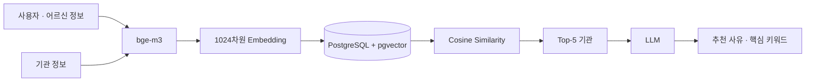

### 최종 구현

- `bge-m3` 문장 임베딩
- 1024차원 Vector
- PostgreSQL + `pgvector`
- Cosine Similarity
- Top-5 기관 추출
- 추천 사유 생성
- LLM 기반 핵심 키워드 추출

### 기관 정보와 AI 임베딩 상태 맞추기

기관 정보가 변경됐는데 AI 서버의 임베딩이 그대로 남아 있으면
업무 데이터와 추천 결과가 다른 상태를 바라보게 됩니다.

프로젝트에서는 기관 CRUD와 AI 임베딩 변경 흐름을 연결했습니다.

| 기관 변경 | Backend | AI Server |
|---|---|---|
| **등록** | 기관 데이터 저장 | Embedding 생성 |
| **수정** | 기관 정보 변경 | Embedding 갱신 |
| **삭제** | 기관 삭제 처리 | Embedding 삭제 |

> AI 기능도 운영 시스템 안에서는 하나의 연결된 구성요소이므로  
> **업무 데이터 변경과 연결 시스템의 상태를 함께 고려했습니다.**

---

## 9. 테스트와 검증 🧪

### 실제 PostgreSQL 기반 통합 테스트

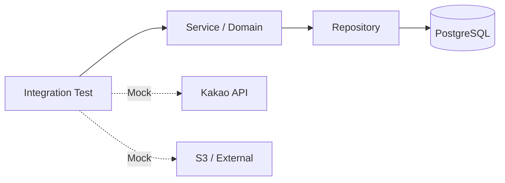

다음 영역을 실제 PostgreSQL 환경에서 확인했습니다.

- Native Haversine Query
- 예약 상태 전이
- 역할별 접근 권한
- Soft Delete
- 날짜 기반 업무 규칙
- 실제 저장·변경 결과

### 상태와 변경 시각을 함께 관리

| 상태 | 함께 기록되는 정보 |
|---|---|
| `PENDING` | 예약 최초 상태 |
| `CONFIRMED` | `confirmedAt` |
| `CANCELED` | `canceledAt` |
| `COMPLETED` | `completedAt` |

---

## 10. 기술 구성 및 협업 방식 🛠️

### 기술 구성

| 영역 | 기술 |
|---|---|
| **Backend** | Java · Spring Boot · Spring Security · JPA/Hibernate · QueryDSL |
| **Database** | PostgreSQL · pgvector |
| **Mobile** | React Native |
| **Web** | Vue |
| **AI** | Python · FastAPI · bge-m3 · LLM |
| **Infrastructure** | AWS · Docker · Nginx |
| **Collaboration** | GitHub Issue · Branch · Pull Request · Code Review |

> 기술 구성은 **프로젝트 전체 기준**입니다.

### Issue-based Development

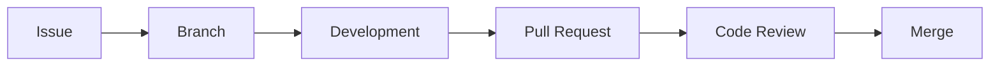

Backend · Frontend · AI를 별도 Repository로 분리하고,
각 구성요소 사이의 API와 데이터 구조를 맞춰 개발했습니다.

---

## 11. 성과 🏆

### 🏆 프로젝트 수상 2회

Caring은 실제 사용자·기관 흐름을 연결한 구현 결과와
서비스 활용 가능성을 인정받아 두 차례 수상했습니다.

- **컴퓨터공학과 2025학년도 2학기 학술제 2등**
- **창의설계경진대회 인기상(4등)**

<p align="center">
  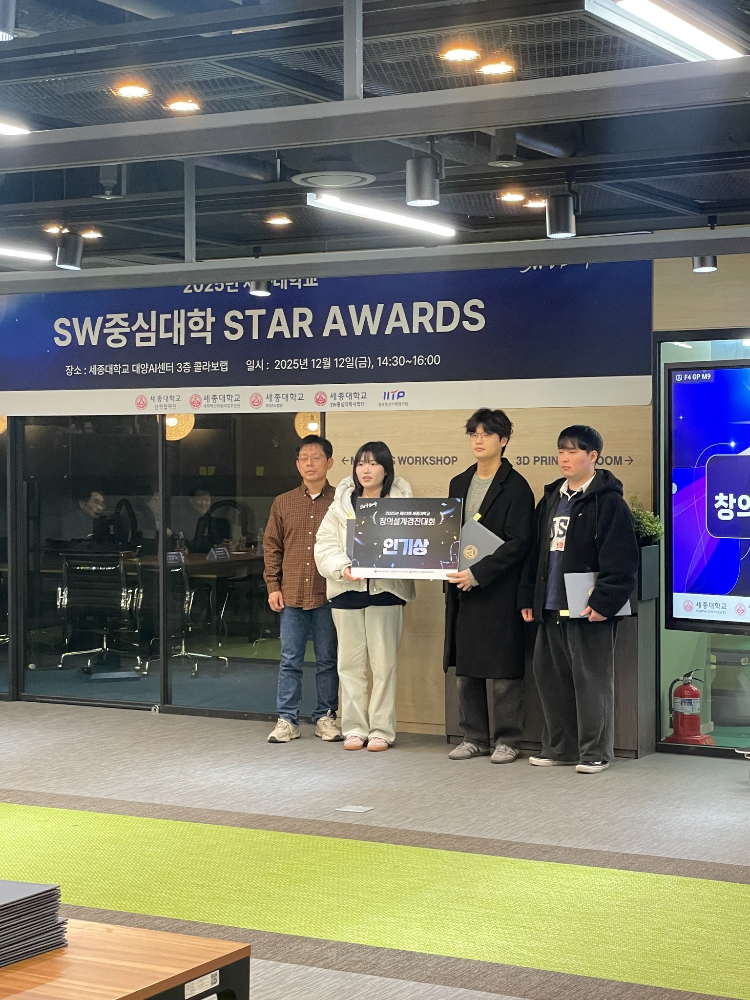
</p>

<details>
<summary><b>프로젝트 전시 현장 보기</b></summary>

<br/>

<p align="center">
  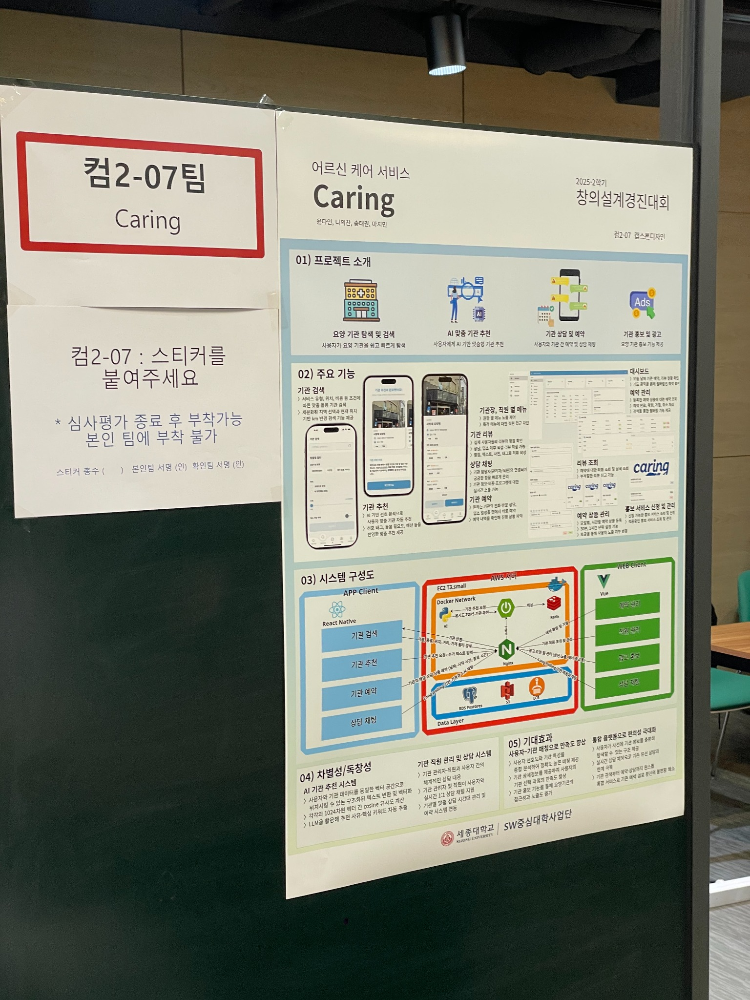
</p>

</details>

---

### 📜 한국저작권위원회 프로그램 저작물 등록 2건

프로젝트 결과물을 SW 산출물로 남기기 위해
서비스와 AI 기능을 각각 프로그램 저작물로 등록했습니다.

| 등록 대상 | 등록번호 |
|---|---|
| **Caring 서비스** | `C-2025-060193` |
| **Caring AI 기능** | `C-2026-002599` |

아래 이미지는 Caring 프로그램 저작물 등록 절차의 실제 접수 화면입니다.

<p align="center">
  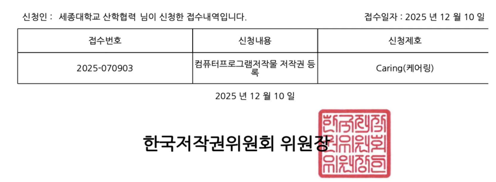
</p>

---

### 🗃️ SW자산뱅크 등재

프로젝트 결과물을 공식 SW 자산으로 남기기 위해
SW자산뱅크 등재까지 진행했습니다.

**등록번호 `ASSET_0015923`**

<p align="center">
  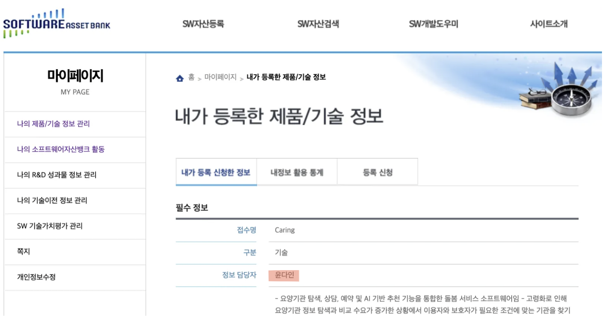
</p>

---

## 12. What I Learned 💭

Caring에서 가장 크게 배운 것은
**사용자가 말한 요구사항을 기능 이름으로 옮기는 것만으로는 충분하지 않다**는 점입니다.

실제 기관의 업무 절차를 확인하면서
사용자와 현재 상태에 따라 허용되는 동작과
남겨야 하는 데이터가 달라진다는 것을 확인했습니다.

그래서 이후에는 요구사항을 받으면 다음 기준부터 확인합니다.

| 확인 기준 | 질문 |
|---|---|
| **사용자** | 누가 이 기능을 사용하는가? |
| **상태** | 현재 사용자는 어떤 상태인가? |
| **권한** | 이 상태에서 어떤 동작이 허용되는가? |
| **전이** | 다음 상태로 이동하기 위한 조건은 무엇인가? |
| **기록** | 상태 변경과 함께 무엇을 남겨야 하는가? |
| **연동** | 연결된 다른 시스템도 함께 변경되어야 하는가? |
| **검증** | 실제 실행 환경에서도 같은 결과가 나오는가? |

예약 상태 전이, 역할별 권한,
PostgreSQL 통합 테스트와 AI 서버 연동은
이 기준을 실제 시스템에 적용하는 과정이었습니다.

> ### 요구사항을 **상태·권한·인터페이스·완료 기준으로 구체화하고, 실제 환경에서 검증하는 개발자**
>
> Caring을 통해 세운 개발 기준입니다.

---

<p align="center">
  <b>Sejong University · Computer Engineering</b><br/>
  Capstone Design · Team Lead / Backend<br/>
  <b>윤다인</b>
</p>
