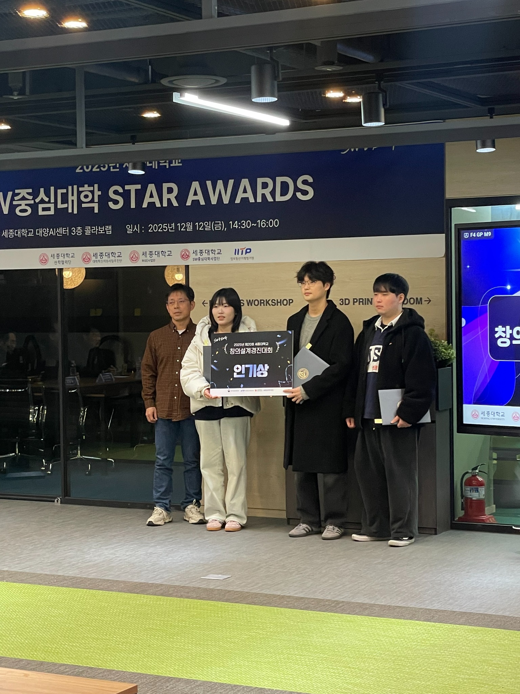

<h1 align="center">💙 Caring</h1>

<h3 align="center">
보호자와 어르신을 위한 맞춤형 요양기관<br/>
탐색 · 추천 · 상담 · 예약 통합 플랫폼
</h3>

<p align="center">
  <b>세종대학교 컴퓨터공학과 Capstone Design · 4인 팀 프로젝트</b>
</p>

<p align="center">
  
  
  
  
  
  
</p>

<br/>

<p align="center">
  
</p>

<br/>

## 📌 Project Highlights

| **IT 대회 2회 수상** | **프로그램 저작물 2건** | **SW자산뱅크 등재** | **4인 팀 · 팀장** |
|:---:|:---:|:---:|:---:|
| 학술제 2등 · 창의설계경진대회 인기상 | 서비스 · AI 기능 | ASSET_0015923 | Backend · PO/PM |

> ### 💡 “요구사항은 기능 목록에서 끝나지 않고, 상태·권한·인터페이스·완료 기준으로 구체화되어야 한다고 생각했습니다.”
>
> 실제 요양기관을 방문해 업무 절차와 불편을 확인하고,  
> 이를 **예약 상태·역할별 권한·검색 조건·데이터 구조**로 구체화해 서비스에 반영했습니다.

### 👩‍💻 프로젝트 한눈에 보기

| 항목 | 내용 |
|---|---|
| **프로젝트** | Caring · 어르신 맞춤형 요양기관 탐색·추천 플랫폼 |
| **기간** | 2025.09 ~ 2025.12 |
| **팀** | 4인 |
| **역할** | 팀장 · Backend · PO/PM |
| **핵심 경험** | 현장 요구분석 · 상태/권한 모델링 · 데이터 정합성 · 실제 DB 검증 |
| **Organization** | [Caring-Team](https://github.com/Caring-Team) |
| **Backend** | [caring-backend](https://github.com/Caring-Team/caring-backend) |
| **Frontend** | [caring-front](https://github.com/Caring-Team/caring-front) |
| **AI** | [caring-ai](https://github.com/Caring-Team/caring-ai) |

> ℹ️ 이 저장소는 채용 포트폴리오용 개인 Showcase입니다.  
> 프로젝트 전체 구현과 개인 역할을 구분해 작성했습니다.

---

## 📜 목차

1. [프로젝트 소개](#1-프로젝트-소개-)
2. [서비스 시연](#2-서비스-시연-)
3. [현장 요구사항에서 시스템 설계까지](#3-현장-요구사항에서-시스템-설계까지-)
4. [담당 역할 및 협업](#4-담당-역할-및-협업-)
5. [시스템 아키텍처](#5-시스템-아키텍처-)
6. [핵심 설계](#6-핵심-설계-)
7. [트러블 슈팅](#7-트러블-슈팅-)
8. [테스트와 검증](#8-테스트와-검증-)
9. [AI 추천 시스템](#9-ai-추천-시스템-)
10. [개발 및 협업 방식](#10-개발-및-협업-방식-)
11. [성과](#11-성과-)
12. [What I Learned](#12-what-i-learned-)

---

# 1. 프로젝트 소개 🌿

## 요양기관을 찾는 과정의 불편을 하나의 서비스 흐름으로 연결하다

요양기관을 선택하려면 보호자가 기관별 정보를 직접 찾아 비교하고,
전화로 상담 가능 여부와 비용을 확인한 뒤 다시 일정을 조율해야 했습니다.

기관 역시 상담·예약·리뷰·홍보 업무가 여러 경로로 분산되어 있어
사용자와 기관 모두에게 반복적인 확인 작업이 발생했습니다.

Caring은 이 과정을 하나의 흐름으로 연결했습니다.

```text
기관 탐색
   ↓
조건별 검색
   ↓
AI 맞춤 추천
   ↓
기관 상세 확인
   ↓
상담
   ↓
예약
   ↓
이용
   ↓
리뷰
```

### 핵심 사용자

- **보호자 / 일반 사용자**  
  기관 검색, 맞춤 추천, 상담, 예약, 리뷰

- **기관 관리자 / 직원**  
  기관 정보, 예약, 직원, 리뷰, 홍보 관리

- **플랫폼 관리자**  
  기관과 사용자, 신고 리뷰 및 서비스 운영 관리

---

# 2. 서비스 시연 🎬

## 🔎 기관 검색 · 조건 필터

기관명과 기관 유형뿐 아니라 전문 분야, 위치, 거리, 가격 등의 조건을 조합해
사용자의 상황에 맞는 기관을 탐색할 수 있습니다.

<p align="center">
  
</p>

- 기관명 검색
- 요양시설 유형 필터
- 전문 분야 및 제공 서비스 조건
- 지역 기반 검색
- 현재 위치 기준 거리 검색
- 가격 범위 설정
- 입소 가능 여부 확인

<br/>

## 💬 상담 · 예약

기관 정보 확인 이후 별도의 서비스로 이동하지 않고
상담과 예약까지 이어질 수 있도록 구성했습니다.

<p align="center">
  
</p>

- 보호자와 기관 담당자 간 상담
- 상담·방문 예약 방식 선택
- 예약 가능 날짜 및 시간 확인
- 예약 상태 확인 및 관리

> 상담 채팅의 현재 구현은 **Server-side Long Polling**입니다.  
> WebSocket을 구현했다고 표현하지 않으며, 동시 연결 규모가 커질 경우 WebSocket 또는 SSE 전환을 고려할 수 있도록 현재 방식의 스레드 점유 한계를 함께 분석했습니다.

<br/>

## 🤖 리뷰 · AI 맞춤 기관 추천

사용자의 선호와 어르신의 상태를 기반으로 기관을 추천하고,
추천 결과와 함께 추천 사유와 핵심 키워드를 제공합니다.

<p align="center">
  
</p>

- 사용자·어르신 특성 기반 기관 추천
- 추천 기관 Top-5 제공
- 추천 사유 및 핵심 키워드 제공
- 기관 리뷰와 최대 5개의 대표 태그 확인

<br/>

## 📅 기관 관리자 예약 · 상품 관리

기관 관리자는 웹에서 상담·예약 요청을 확인하고
예약 상품과 운영 가능 시간을 관리합니다.

<p align="center">
  
</p>

- 예약 요청 및 상태 조회
- 예약 상태 변경
- 요일·시간대별 예약 상품 등록
- 사용자 노출 여부 관리

<br/>

## 🏢 기관 운영 관리

기관 정보뿐 아니라 직원, 태그, 홍보 서비스 등을
웹 관리자 화면에서 관리합니다.

<p align="center">
  
</p>

- 기관 직원 및 권한 관리
- 기관 설명 태그 관리
- 홍보 서비스 신청·조회
- 대시보드 기반 예약·리뷰 현황 확인

---

# 3. 현장 요구사항에서 시스템 설계까지 📝

## 실제 기관에서 먼저 물었습니다

서비스를 설계하기 전에 실제 요양기관을 방문해
기관 관리자를 대상으로 인터뷰를 진행했습니다.

현장에서 반복적으로 확인된 문제는 다음과 같았습니다.

### 보호자 관점

- 기관별 정보 형식이 달라 직접 비교하기 어려움
- 상담 가능 시간과 입소 가능 여부를 전화로 확인해야 함
- 기관마다 예약 절차가 달라 이용 과정이 복잡함

### 기관 관점

- 상담·예약·리뷰 관리가 분산됨
- 기관의 프로그램과 장점을 알릴 홍보 채널이 부족함
- 직원별 담당 범위와 접근 가능한 업무를 구분해야 함

이 내용을 요구사항 분석에 반영했습니다.

### 요구사항을 기능보다 규칙으로 구체화

```text
현장 요구

"예약을 받은 뒤 기관에서 승인하고
완료 여부까지 관리하고 싶다."

        ↓

SW 규칙

Reservation Status
PENDING
   ↓
CONFIRMED
   ↓
COMPLETED

또는
CANCELED
```

```text
현장 요구

"기관장과 직원이 보는 메뉴가 달라야 한다."

        ↓

권한 모델

OWNER
STAFF
USER
ADMIN
Temporary User
```

기능 목록을 만드는 데서 끝내지 않고
**누가 어떤 상태에서 무엇을 할 수 있는지**를 코드와 데이터 구조로 구체화했습니다.

---

# 4. 담당 역할 및 협업 👩‍💻

## Team Lead · Backend · PO/PM

4인 팀 프로젝트에서 팀장으로 참여해
요구사항과 프로젝트 진행 기준을 정리하고 백엔드 개발에 참여했습니다.

### 주요 역할

- 요양기관 현장 방문 및 요구사항 정리
- 사용자·기관 관리자 업무 흐름 구체화
- 기능 우선순위 및 프로젝트 일정 조율
- API·데이터 구조·역할별 기능 기준 정리
- Spring Boot 기반 Backend 개발
- 예약 상태·권한·데이터 정합성 관련 설계 검토
- Frontend·AI·Backend 간 연동 기준 조율
- GitHub Issue / Pull Request 기반 협업 관리
- 발표 및 프로젝트 결과 정리

### 팀 개발 기준

프로젝트는 기능과 작업 단위마다 GitHub Issue를 만들고
해당 이슈 번호를 포함하는 브랜치에서 독립적으로 개발했습니다.

```text
Issue 생성
    ↓
Branch 생성
    ↓
개발
    ↓
Pull Request
    ↓
Code Review
    ↓
Merge
```

---

# 5. 시스템 아키텍처 🏗️

```text
┌──────────────────────┐
│ React Native Mobile  │
│ 보호자 / 사용자       │
└──────────┬───────────┘
           │ REST API
           │
           ▼
┌───────────────────────────────┐
│       Spring Boot Backend     │
│                               │
│ User / Institution / Review   │
│ Reservation / Chat / Security │
└───────┬─────────┬─────────────┘
        │         │
        │         └──────────────────────┐
        │                                │
        ▼                                ▼
┌─────────────────┐            ┌──────────────────┐
│ PostgreSQL      │            │ FastAPI AI       │
│ + pgvector      │◀──────────▶│ Recommendation   │
└─────────────────┘            └──────────────────┘
        │
        ├─ 관계형 업무 데이터
        └─ 기관 임베딩 벡터

┌──────────────────────┐
│       Vue Web        │
│ 기관 관리자 / 직원    │
└──────────┬───────────┘
           │
           └──────────── Spring Boot API

Infrastructure
AWS EC2 · RDS · S3 · Redis · Docker · Nginx
```

### Repository

```text
Caring-Team

├── caring-backend     # Java / Spring Boot
├── caring-front       # React Native
└── caring-ai          # Python / AI Recommendation
```

| Repository | 역할 |
|---|---|
| [caring-backend](https://github.com/Caring-Team/caring-backend) | 회원·기관·예약·리뷰·채팅·권한 등 핵심 서버 로직 |
| [caring-front](https://github.com/Caring-Team/caring-front) | 사용자 모바일 애플리케이션 |
| [caring-ai](https://github.com/Caring-Team/caring-ai) | 기관 임베딩 및 추천 로직 |

---

# 6. 핵심 설계 🧩

## 6-1. 예약 상태와 전이 조건을 한곳에서 관리

예약은 단순한 CRUD 데이터가 아니라
업무 진행 과정에 따라 상태가 변하는 데이터였습니다.

초기에는 Service에서 상태를 직접 변경할 수 있었지만,
이 방식은 상태만 변경하고 변경 시각을 빠뜨리거나
잘못된 상태 전이를 허용할 가능성이 있었습니다.

그래서 상태 변경 규칙을 `Reservation` 내부로 이동했습니다.

```java
public void updateToConfirmed() {
    validateStatus(ReservationStatus.PENDING);

    this.status = ReservationStatus.CONFIRMED;
    this.confirmedAt = LocalDateTime.now();
}

public void updateToCompleted() {
    validateStatus(ReservationStatus.CONFIRMED);

    this.status = ReservationStatus.COMPLETED;
    this.completedAt = LocalDateTime.now();
}

public void updateToCanceled() {
    validateCancelable();

    this.status = ReservationStatus.CANCELED;
    this.canceledAt = LocalDateTime.now();
}
```

### 결과

- 상태와 변경 시각을 함께 관리
- 허용되지 않은 상태 전이 차단
- 상태 규칙 변경 시 수정 범위를 엔티티 내부로 제한

> **상태는 값 하나가 아니라 다음 동작을 결정하는 업무 규칙**이라고 보고 설계했습니다.

---

## 6-2. 인증 상태까지 Role로 모델링

소셜 인증을 완료했지만 회원가입 정보 입력은 끝나지 않은
중간 상태의 사용자가 존재했습니다.

이를 일반 사용자와 동일하게 취급하면
회원가입을 완료하지 않은 사용자가 다른 API까지 호출할 수 있습니다.

따라서 상태를 별도 Role로 표현했습니다.

```text
Member
└─ ROLE_USER

Temporary Member
└─ ROLE_TEMP_OAUTH

Institution Owner
└─ ROLE_INSTITUTION_OWNER

Institution Staff
└─ ROLE_INSTITUTION_STAFF

Temporary Institution
└─ ROLE_TEMP_INSTITUTION
```

예를 들어 `TEMP_OAUTH` 사용자는 회원가입 완료 API만 호출할 수 있도록
Security Layer에서 접근 범위를 제한했습니다.

---

## 6-3. 복잡한 기관 검색 조건 분리

기관 검색에는 다양한 조건이 사용됩니다.

- 기관명
- 기관 유형
- 전문 분야
- 가격
- 위치
- 거리
- 삭제 여부

QueryDSL에서는 조건별 `BooleanExpression`을 별도 메서드로 분리해
각 검색 조건을 독립적으로 관리할 수 있도록 구성했습니다.

```java
.where(
    notDeleted(),
    nameContains(filter.getName()),
    institutionTypeEq(filter.getInstitutionType()),
    priceLoe(filter.getMaxPrice())
)
```

위치 기반 검색에는 PostgreSQL Native Query와
Haversine 계산을 활용했습니다.

<p align="center">
  
</p>

---

# 7. 트러블 슈팅 🛠️

## ⭐ 01. H2에서 통과해도 실제 PostgreSQL에서는 다를 수 있다

> **테스트 환경과 실제 실행 환경의 차이를 줄이는 것을 우선했습니다.**

### 🔴 Problem

기관 검색에는 Native Haversine Query와
PostgreSQL 특정 함수가 사용됐습니다.

H2는 이러한 PostgreSQL의 실제 동작을 완전히 재현하지 못하기 때문에
H2 테스트가 성공해도 운영 DB에서 같은 결과가 난다고 보장할 수 없었습니다.

### 🔍 판단

테스트하기 편한 DB를 사용하는 것보다
**실제로 서비스가 실행될 DB와 같은 조건에서 검증하는 것이 더 중요하다**고 판단했습니다.

### 🟢 Solution

`@DynamicPropertySource`를 사용해
통합 테스트에서도 실제 PostgreSQL을 사용했습니다.

```java
@DynamicPropertySource
static void configureProperties(
        DynamicPropertyRegistry registry) {

    registry.add(
        "spring.datasource.url",
        () -> Optional
            .ofNullable(System.getenv("TEST_DB_URL"))
            .orElse(
                "jdbc:postgresql://localhost:5432/caringdb"
            )
    );
}
```

외부 서비스는 별도로 격리했습니다.

```text
실제 사용
PostgreSQL

Mock
├─ Kakao Geocoding API
├─ S3
└─ 외부 서비스
```

### ✅ Result

- PostgreSQL Native Query 실제 동작 검증
- H2와 운영 DB의 차이로 발생할 수 있는 오류 감소
- 외부 API 상태와 관계없는 반복 가능한 통합 테스트 구성

> **테스트하기 쉬운 환경보다 실제 환경에서 같은 결과가 나오는지를 더 중요하게 봤습니다.**

---

## 02. Soft Delete인데 직원 데이터가 실제로 삭제되던 문제

<details>
<summary><b>상세 내용 펼쳐보기</b></summary>

<br/>

프로젝트에서는 데이터를 즉시 삭제하지 않고
`deleted = true`로 상태만 변경하는 soft delete 정책을 사용했습니다.

하지만 기관을 삭제하는 과정에서 소속 직원 데이터가
논리 삭제가 아니라 실제 DB에서 물리 삭제되는 문제가 발생했습니다.

### Root Cause

```java
cascade = CascadeType.ALL
orphanRemoval = true
```

`CascadeType.ALL`에는 REMOVE가 포함되고,
`orphanRemoval=true`는 관계가 끊긴 자식 엔티티에 실제 DELETE를 실행합니다.

즉 JPA 설정이 프로젝트의 soft delete 정책을 우회하고 있었습니다.

### Solution

```java
@OneToMany(
    mappedBy = "institution",
    cascade = CascadeType.PERSIST,
    orphanRemoval = false
)
```

- Cascade 범위를 `PERSIST`로 축소
- `orphanRemoval` 비활성화
- 삭제 전 연관관계를 정리하는 로직을 엔티티 내부에 캡슐화

### Learned

공통으로 설계한 정책이 있어도
프레임워크 옵션에 따라 실제 DB 동작은 달라질 수 있음을 확인했습니다.

**설계 의도와 실제 DB 결과가 같은지 확인하는 과정이 필요했습니다.**

</details>

---

## 03. 날짜가 지나야만 발생하는 조건을 어떻게 테스트할까?

<details>
<summary><b>상세 내용 펼쳐보기</b></summary>

<br/>

리뷰는 작성일 이후 일정 기간 동안만 수정할 수 있었습니다.

하지만 테스트에서 방금 만든 리뷰는 항상 현재 시각을 갖기 때문에
실제로 30일이 흐를 때까지 기다릴 수 없습니다.

그래서 실제 DB의 `created_at`을 Native Query로 직접 조정했습니다.

```java
entityManager.createNativeQuery(
    "UPDATE review " +
    "SET created_at = :pastDate " +
    "WHERE id = :reviewId"
)
.setParameter(
    "pastDate",
    LocalDateTime.now().minusDays(31)
)
.executeUpdate();

entityManager.flush();
entityManager.clear();
```

이를 통해 실제 PostgreSQL에서
**31일이 지난 상태를 만들어 비즈니스 규칙을 검증**했습니다.

</details>

---

## 04. 상담 채팅 — 현재 제약에 맞는 Long Polling 선택

<details>
<summary><b>상세 내용 펼쳐보기</b></summary>

<br/>

채팅은 WebSocket이 아니라
서버 사이드 Long Polling 방식으로 구현했습니다.

```text
Client Request
      │
      ▼
30초 동안 신규 메시지 확인
      │
      ├─ 메시지 있음 → 즉시 반환
      │
      └─ 없음 → timeout 후 재요청
```

서버에서는 약 0.5초 간격으로 신규 메시지를 확인합니다.

### Trade-off

**장점**

- 기존 REST 인프라 활용
- 구현 및 운영 구조 단순

**한계**

- 요청을 기다리는 동안 Tomcat Thread 점유
- 동시 접속 증가 시 Thread Pool 고갈 가능

따라서 사용자 규모가 커질 경우
WebSocket + Redis Pub/Sub 또는 SSE 등의 구조로 전환할 필요가 있음을
함께 고려했습니다.

</details>

---

# 8. 테스트와 검증 🧪

## 실제 DB 기반 Integration Test

```text
Application
     │
     ▼
Integration Test
     │
     ├─ PostgreSQL      ← 실제 DB
     │
     ├─ Repository
     │
     ├─ Service
     │
     └─ Domain Rule
     
외부 서비스
     └─ Mock으로 격리
```

특히 다음과 같은 영역을 실제 PostgreSQL 환경에서 확인했습니다.

- Native Haversine Query
- 예약 상태 전이
- 역할별 접근 권한
- soft delete
- 날짜 기반 비즈니스 규칙
- 리뷰·기관·예약 데이터의 실제 저장 결과

---

## 상태 변경 시각까지 검증

예약 상태를 바꾸는 것만 확인하지 않고
상태 변경과 함께 기록되는 시각까지 하나의 규칙으로 관리했습니다.

```text
PENDING
   │
   ├─ CONFIRMED
   │      └─ confirmedAt
   │
   ├─ CANCELED
   │      └─ canceledAt
   │
   └─ CONFIRMED → COMPLETED
          └─ completedAt
```

---

# 9. AI 추천 시스템 🤖

## 최종 구현 구조

최종 구현에서는 사용자와 기관의 정보를
**동일한 벡터 공간에서 비교하는 추천 구조**를 사용했습니다.

<p align="center">
  
</p>

```text
사용자 / 어르신 정보
       │
       ▼
구조화된 Text
       │
       ▼
bge-m3 Embedding
1024 dimensions
       │
       ▼
PostgreSQL + pgvector
       │
       ▼
Cosine Similarity
       │
       ▼
Top-5 Institution
       │
       ▼
LLM
추천 사유 · 핵심 키워드
```

### AI 서버

- `bge-m3` 문장 임베딩
- 1024차원 Vector
- PostgreSQL `pgvector`
- Cosine Similarity
- Top-5 기관 추출
- 추천 사유 생성
- LLM 기반 핵심 키워드 생성

---

## 기관 데이터와 AI 임베딩 상태 맞추기

기관 정보는 계속 변경될 수 있습니다.

Backend DB에서 기관이 수정되었는데
AI 서버의 임베딩이 그대로 남아 있으면
실제 기관 정보와 추천 결과가 달라질 수 있습니다.

그래서 기관 CRUD와 AI 임베딩을 연결했습니다.

```text
기관 등록
   │
   ├─ PostgreSQL 저장
   └─ AI Server Embedding 생성

기관 수정
   │
   ├─ PostgreSQL 수정
   └─ AI Server Embedding 갱신

기관 삭제
   │
   ├─ Backend 처리
   └─ AI Server Embedding 삭제
```

AI 서버 호출은 다른 외부 API와 분리된
전용 `RestTemplate`을 사용했습니다.

```java
@Qualifier("aiServerRestTemplate")
```

별도 연결·읽기 timeout과 Error Handler를 적용해
AI 서버 연동 설정을 독립적으로 관리했습니다.

> AI 기능 자체뿐 아니라 **업무 데이터가 변경될 때 연결된 시스템의 상태도 함께 맞아야 한다**는 점을 고려했습니다.

---

# 10. 개발 및 협업 방식 🤝

## Issue-based Branching

프로젝트의 기능 개발, 버그 수정, 리팩토링은
GitHub Issue를 기준으로 관리했습니다.

```text
Issue
   ↓
Issue Branch
   ↓
Development
   ↓
Pull Request
   ↓
Code Review
   ↓
Merge
```

Backend / Frontend / AI를 각각 별도 Repository로 나누고,
필요한 API와 데이터 구조를 기준으로 연동했습니다.

---

## 기술 구성 🛠️

| 영역 | 기술 |
|---|---|
| **Backend** | Java, Spring Boot, Spring Security, JPA / Hibernate, QueryDSL |
| **Database** | PostgreSQL, pgvector, Redis |
| **Mobile** | React Native, Expo |
| **Web** | Vue |
| **AI** | Python, FastAPI, bge-m3, LLM |
| **Infra** | AWS EC2, RDS, S3, ECR |
| **Deployment** | Docker, Nginx, GitHub Actions |
| **Collaboration** | GitHub Issue, Branch, Pull Request, Code Review |

---

# 11. 성과 🏆

## IT 대회 2회 수상

### 🥈 컴퓨터공학과 2025학년도 2학기 학술제 2등

서비스의 AI 추천 기능, 사용자와 기관을 연결하는 전체 업무 흐름,
서비스 확장 가능성을 발표해 학술제 2등을 수상했습니다.

### 🏅 창의설계경진대회 인기상

현장 요구사항을 기반으로 구현한 사용자 앱과 기관 관리자 웹,
기관 검색·추천·상담·예약을 하나로 연결한 결과물을 인정받아 수상했습니다.

<p align="center">
  
</p>

---

## 프로그램 저작물 등록 2건

### Caring 서비스

**한국저작권위원회 프로그램 등록번호**

```text
C-2025-060193
```

### Caring AI 기능

**한국저작권위원회 프로그램 등록번호**

```text
C-2026-002599
```

---

## SW자산뱅크 등재

학교 필수 제출 범위 이후에도
프로젝트 결과물을 공식적으로 남기기 위해 별도로 등재 절차를 진행했습니다.

```text
SW자산뱅크
ASSET_0015923
```

---

## 창의설계경진대회

<details>
<summary><b>프로젝트 전시 현장 보기</b></summary>

<br/>

<p align="center">
  
</p>

</details>

---

# 12. What I Learned 💭

이 프로젝트에서 가장 크게 배운 것은
**사용자가 말한 요구사항을 기능 이름으로 옮기는 것만으로는 충분하지 않다**는 점입니다.

실제 요양기관을 찾아가 업무 절차와 불편을 들으면서
같은 기능도 사용자에 따라 필요한 권한과 상태가 달라진다는 것을 확인했습니다.

그래서 이후에는 새로운 요구사항을 받으면 먼저 다음을 확인합니다.

### 요구사항을 받으면 확인하는 기준

- **누가** 이 기능을 사용하는가
- 현재 사용자는 **어떤 상태**인가
- 이 상태에서 **어떤 동작이 허용되는가**
- 다음 상태로 이동하기 위한 **조건은 무엇인가**
- 상태가 바뀔 때 함께 남겨야 할 **데이터와 기록은 무엇인가**
- 연결된 다른 시스템의 데이터도 **함께 변경되어야 하는가**
- 실제 운영 DB에서도 **동일하게 동작하는가**

예약 상태 전이, 역할별 권한,
PostgreSQL 통합 테스트와 AI 서버 연동 모두
이 기준을 구체화하는 과정이었습니다.

> ### 요구사항을 **상태·권한·인터페이스·완료 기준으로 구체화하고, 실제 환경에서 검증하는 개발자**
>
> Caring을 통해 세운 개발 기준입니다.

---

<p align="center">
  <b>Sejong University · Computer Engineering</b><br/>
  Capstone Design · Team Lead / Backend<br/>
  <b>윤다인</b>
</p>
